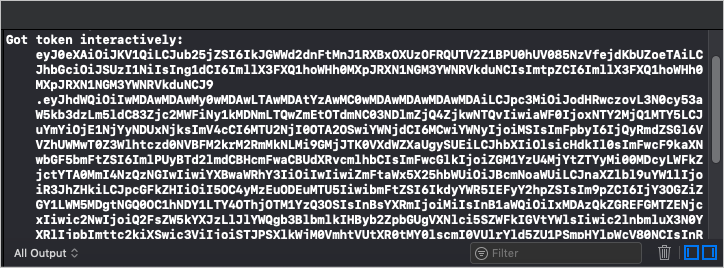

<!-- markdownlint-disable MD002 MD041 -->

在本练习中，你将扩展上一练习中的应用程序，以支持 Azure AD 的身份验证。 若要获取所需的 OAuth 访问令牌以调用 Microsoft Graph，这是必需的。 为此，需要将[iOS 的 Microsoft 身份验证库（MSAL）](https://github.com/AzureAD/microsoft-authentication-library-for-objc)集成到应用程序中。

1. 在名为**AuthSettings**的**GraphTutorial**项目中创建一个新的**属性列表**文件。
1. 将以下项添加到**根**字典中的文件中。

    | 键 | 类型 | 值 |
    |-----|------|-------|
    | `AppId` | String | Azure 门户中的应用程序 ID |
    | `GraphScopes` | 数组 | 两个字符串值`User.Read` ：和`Calendars.Read` |

    

> [!IMPORTANT]
> 如果您使用的是源代码管理（如 git），现在是从源代码控制中排除**AuthSettings**文件以避免无意中泄漏您的应用程序 ID 的最佳时机。

## <a name="implement-sign-in"></a>实施登录

在本节中，您将为 MSAL 配置项目，创建身份验证管理器类，并更新应用程序以进行登录和注销。

### <a name="configure-project-for-msal"></a>为 MSAL 配置项目

1. 将新的密钥链组添加到项目的功能中。
    1. 依次选择 " **GraphTutorial** " 项目、"**签名 & 功能**"。
    1. 选择 " **+ 功能**"，然后双击 "**密钥链共享**"。
    1. 添加具有值`com.microsoft.adalcache`的密钥链组。

1. 控件单击 " **plist** "，然后选择 "**打开方式**"，然后选择 "**源代码**"。
1. 在`<dict>`元素内添加以下项。

    ```xml
    <key>CFBundleURLTypes</key>
    <array>
      <dict>
        <key>CFBundleURLSchemes</key>
        <array>
          <string>msauth.$(PRODUCT_BUNDLE_IDENTIFIER)</string>
        </array>
      </dict>
    </array>
    <key>LSApplicationQueriesSchemes</key>
    <array>
        <string>msauthv2</string>
        <string>msauthv3</string>
    </array>
    ```

1. 打开**AppDelegate** ，并在文件的顶部添加以下导入语句。

    ```Swift
    import MSAL
    ```

1. 将以下函数添加到 `AppDelegate` 类。

    ```Swift
    func application(_ app: UIApplication, open url: URL, options: [UIApplication.OpenURLOptionsKey : Any] = [:]) -> Bool {

        guard let sourceApplication = options[UIApplication.OpenURLOptionsKey.sourceApplication] as? String else {
            return false
        }

        return MSALPublicClientApplication.handleMSALResponse(url, sourceApplication: sourceApplication)
    }
    ```

### <a name="create-authentication-manager"></a>创建身份验证管理器

1. 在名为**authenticationmanager.java**的**GraphTutorial**项目中创建一个新的**Swift 文件**。 将以下代码添加到文件中。

    ```Swift
    import Foundation
    import MSAL
    import MSGraphClientSDK

    // Implement the MSAuthenticationProvider interface so
    // this class can be used as an auth provider for the Graph SDK
    class AuthenticationManager: NSObject, MSAuthenticationProvider {

        // Implement singleton pattern
        static let instance = AuthenticationManager()

        private let publicClient: MSALPublicClientApplication?
        private let appId: String
        private let graphScopes: Array<String>

        private override init() {
            // Get app ID and scopes from AuthSettings.plist
            let bundle = Bundle.main
            let authConfigPath = bundle.path(forResource: "AuthSettings", ofType: "plist")!
            let authConfig = NSDictionary(contentsOfFile: authConfigPath)!

            self.appId = authConfig["AppId"] as! String
            self.graphScopes = authConfig["GraphScopes"] as! Array<String>

            do {
                // Create the MSAL client
                try self.publicClient = MSALPublicClientApplication(clientId: self.appId)
            } catch {
                print("Error creating MSAL public client: \(error)")
                self.publicClient = nil
            }
        }

        // Required function for the MSAuthenticationProvider interface
        func getAccessToken(for authProviderOptions: MSAuthenticationProviderOptions!, andCompletion completion: ((String?, Error?) -> Void)!) {
            getTokenSilently(completion: completion)
        }

        public func getTokenInteractively(parentView: UIViewController, completion: @escaping(_ accessToken: String?, Error?) -> Void) {
            let webParameters = MSALWebviewParameters(parentViewController: parentView)
            let interactiveParameters = MSALInteractiveTokenParameters(scopes: self.graphScopes,
                                                                       webviewParameters: webParameters)

            // Call acquireToken to open a browser so the user can sign in
            publicClient?.acquireToken(with: interactiveParameters, completionBlock: {
                (result: MSALResult?, error: Error?) in
                guard let tokenResult = result, error == nil else {
                    print("Error getting token interactively: \(String(describing: error))")
                    completion(nil, error)
                    return
                }

                print("Got token interactively: \(tokenResult.accessToken)")
                completion(tokenResult.accessToken, nil)
            })
        }

        public func getTokenSilently(completion: @escaping(_ accessToken: String?, Error?) -> Void) {
            // Check if there is an account in the cache
            var userAccount: MSALAccount?

            do {
                userAccount = try publicClient?.allAccounts().first
            } catch {
                print("Error getting account: \(error)")
            }

            if (userAccount != nil) {
                // Attempt to get token silently
                let silentParameters = MSALSilentTokenParameters(scopes: self.graphScopes, account: userAccount!)
                publicClient?.acquireTokenSilent(with: silentParameters, completionBlock: {
                    (result: MSALResult?, error: Error?) in
                    guard let tokenResult = result, error == nil else {
                        print("Error getting token silently: \(String(describing: error))")
                        completion(nil, error)
                        return
                    }

                    print("Got token silently: \(tokenResult.accessToken)")
                    completion(tokenResult.accessToken, nil)
                })
            } else {
                print("No account in cache")
                completion(nil, NSError(domain: "AuthenticationManager",
                                        code: MSALError.interactionRequired.rawValue, userInfo: nil))
            }
        }

        public func signOut() -> Void {
            do {
                // Remove all accounts from the cache
                let accounts = try publicClient?.allAccounts()

                try accounts!.forEach({
                    (account: MSALAccount) in
                    try publicClient?.remove(account)
                })
            } catch {
                print("Sign out error: \(String(describing: error))")
            }
        }
    }
    ```

### <a name="add-sign-in-and-sign-out"></a>添加登录和注销

1. 打开**SignInViewController** ，并将其内容替换为以下代码。

    ```Swift
    import UIKit

    class SignInViewController: UIViewController {

        private let spinner = SpinnerViewController()

        override func viewDidLoad() {
            super.viewDidLoad()
            // Do any additional setup after loading the view.

            // See if a user is already signed in
            spinner.start(container: self)

            AuthenticationManager.instance.getTokenSilently {
                (token: String?, error: Error?) in

                DispatchQueue.main.async {
                    self.spinner.stop()

                    guard let _ = token, error == nil else {
                        // If there is no token or if there's an error,
                        // no user is signed in, so stay here
                        return
                    }

                    // Since we got a token, a user is signed in
                    // Go to welcome page
                    self.performSegue(withIdentifier: "userSignedIn", sender: nil)
                }
            }
        }

        @IBAction func signIn() {
            spinner.start(container: self)

            // Do an interactive sign in
            AuthenticationManager.instance.getTokenInteractively(parentView: self) {
                (token: String?, error: Error?) in

                DispatchQueue.main.async {
                    self.spinner.stop()

                    guard let _ = token, error == nil else {
                        // Show the error and stay on the sign-in page
                        let alert = UIAlertController(title: "Error signing in",
                                                      message: error.debugDescription,
                                                      preferredStyle: .alert)

                        alert.addAction(UIAlertAction(title: "OK", style: .default, handler: nil))
                        self.present(alert, animated: true)
                        return
                    }

                    // Signed in successfully
                    // Go to welcome page
                    self.performSegue(withIdentifier: "userSignedIn", sender: nil)
                }
            }
        }
    }
    ```

1. 打开**WelcomeViewController** ，并将现有`signOut`函数替换为以下项。

    ```Swift
    @IBAction func signOut() {
        AuthenticationManager.instance.signOut()
        self.performSegue(withIdentifier: "userSignedOut", sender: nil)
    }
    ```

1. 保存所做的更改，并在模拟器中重新启动应用程序。

如果登录到应用，您应该会看到在 Xcode 的输出窗口中显示的访问令牌。



## <a name="get-user-details"></a>获取用户详细信息

在本节中，您将创建一个帮助程序类，以保存对 Microsoft Graph 的所有调用并`WelcomeViewController`更新，以使用此新类获取已登录的用户。

1. 在名为**GraphManager**的**GraphTutorial**项目中创建一个新的**Swift 文件**。 将以下代码添加到文件中。

    ```Swift
    import Foundation
    import MSGraphClientSDK
    import MSGraphClientModels

    class GraphManager {

        // Implement singleton pattern
        static let instance = GraphManager()

        private let client: MSHTTPClient?

        private init() {
            client = MSClientFactory.createHTTPClient(with: AuthenticationManager.instance)
        }

        public func getMe(completion: @escaping(MSGraphUser?, Error?) -> Void) {
            // GET /me
            let meRequest = NSMutableURLRequest(url: URL(string: "\(MSGraphBaseURL)/me")!)
            let meDataTask = MSURLSessionDataTask(request: meRequest, client: self.client, completion: {
                (data: Data?, response: URLResponse?, graphError: Error?) in
                guard let meData = data, graphError == nil else {
                    completion(nil, graphError)
                    return
                }

                do {
                    // Deserialize response as a user
                    let user = try MSGraphUser(data: meData)
                    completion(user, nil)
                } catch {
                    completion(nil, error)
                }
            })

            // Execute the request
            meDataTask?.execute()
        }
    }
    ```

1. 打开**WelcomeViewController** ，并在文件顶部添加`import`以下语句。

    ```Swift
    import MSGraphClientModels
    ```

1. 将以下属性添加到`WelcomeViewController`类中。

    ```Swift
    private let spinner = SpinnerViewController()
    ```

1. 将现有`viewDidLoad`替换为以下代码。

    ```Swift
    override func viewDidLoad() {
        super.viewDidLoad()

        // Do any additional setup after loading the view.

        self.spinner.start(container: self)

        // Get the signed-in user
        self.userProfilePhoto.image = UIImage(imageLiteralResourceName: "DefaultUserPhoto")

        GraphManager.instance.getMe {
            (user: MSGraphUser?, error: Error?) in

            DispatchQueue.main.async {
                self.spinner.stop()

                guard let currentUser = user, error == nil else {
                    print("Error getting user: \(String(describing: error))")
                    return
                }

                // Set display name
                self.userDisplayName.text = currentUser.displayName ?? "Mysterious Stranger"
                self.userDisplayName.sizeToFit()

                // AAD users have email in the mail attribute
                // Personal accounts have email in the userPrincipalName attribute
                self.userEmail.text = currentUser.mail ?? currentUser.userPrincipalName ?? ""
                self.userEmail.sizeToFit()
            }
        }
    }
    ```

如果现在保存更改并重新启动应用程序，则在使用用户的显示名称和电子邮件地址更新 UI 后，登录 UI。
