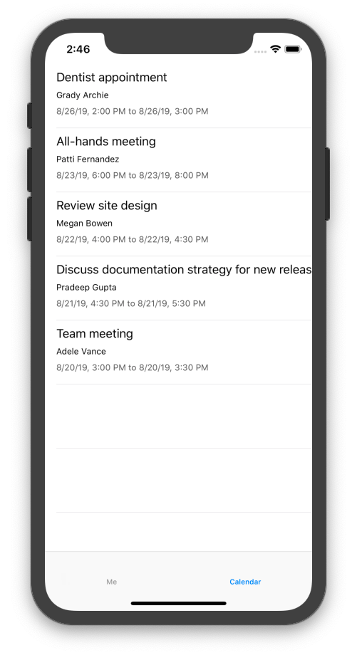

<!-- markdownlint-disable MD002 MD041 -->

<span data-ttu-id="cee9e-101">在本练习中，将把 Microsoft Graph 合并到应用程序中。</span><span class="sxs-lookup"><span data-stu-id="cee9e-101">In this exercise you will incorporate the Microsoft Graph into the application.</span></span> <span data-ttu-id="cee9e-102">对于此应用程序，您将使用[Microsoft GRAPH SDK For 目标 C](https://github.com/microsoftgraph/msgraph-sdk-objc)以调用 microsoft graph。</span><span class="sxs-lookup"><span data-stu-id="cee9e-102">For this application, you will use the [Microsoft Graph SDK for Objective C](https://github.com/microsoftgraph/msgraph-sdk-objc) to make calls to Microsoft Graph.</span></span>

## <a name="get-calendar-events-from-outlook"></a><span data-ttu-id="cee9e-103">从 Outlook 获取日历事件</span><span class="sxs-lookup"><span data-stu-id="cee9e-103">Get calendar events from Outlook</span></span>

<span data-ttu-id="cee9e-104">在本节中，您将扩展`GraphManager`类以添加一个函数，以获取用户的事件并更新`CalendarViewController`以使用这些新函数。</span><span class="sxs-lookup"><span data-stu-id="cee9e-104">In this section you will extend the `GraphManager` class to add a function to get the user's events and update `CalendarViewController` to use these new functions.</span></span>

1. <span data-ttu-id="cee9e-105">打开**GraphManager** ，并将以下方法添加到`GraphManager`类中。</span><span class="sxs-lookup"><span data-stu-id="cee9e-105">Open **GraphManager.swift** and add the following method to the `GraphManager` class.</span></span>

    ```Swift
    public func getEvents(completion: @escaping(Data?, Error?) -> Void) {
        // GET /me/events?$select='subject,organizer,start,end'$orderby=createdDateTime DESC
        // Only return these fields in results
        let select = "$select=subject,organizer,start,end"
        // Sort results by when they were created, newest first
        let orderBy = "$orderby=createdDateTime+DESC"
        let eventsRequest = NSMutableURLRequest(url: URL(string: "\(MSGraphBaseURL)/me/events?\(select)&\(orderBy)")!)
        let eventsDataTask = MSURLSessionDataTask(request: eventsRequest, client: self.client, completion: {
            (data: Data?, response: URLResponse?, graphError: Error?) in
            guard let eventsData = data, graphError == nil else {
                completion(nil, graphError)
                return
            }

            // TEMPORARY
            completion(eventsData, nil)
        })

        // Execute the request
        eventsDataTask?.execute()
    }
    ```

    > [!NOTE]
    > <span data-ttu-id="cee9e-106">考虑中`getEvents`的代码执行的操作。</span><span class="sxs-lookup"><span data-stu-id="cee9e-106">Consider what the code in `getEvents` is doing.</span></span>
    >
    > - <span data-ttu-id="cee9e-107">将调用的 URL 为`/v1.0/me/events`。</span><span class="sxs-lookup"><span data-stu-id="cee9e-107">The URL that will be called is `/v1.0/me/events`.</span></span>
    > - <span data-ttu-id="cee9e-108">`select`查询参数将为每个事件返回的字段限制为仅应用程序实际使用的字段。</span><span class="sxs-lookup"><span data-stu-id="cee9e-108">The `select` query parameter limits the fields returned for each events to just those the app will actually use.</span></span>
    > - <span data-ttu-id="cee9e-109">`orderby`查询参数按其创建日期和时间对结果进行排序，最新项目最先开始。</span><span class="sxs-lookup"><span data-stu-id="cee9e-109">The `orderby` query parameter sorts the results by the date and time they were created, with the most recent item being first.</span></span>

1. <span data-ttu-id="cee9e-110">打开**CalendarViewController** ，并将其全部内容替换为以下代码。</span><span class="sxs-lookup"><span data-stu-id="cee9e-110">Open **CalendarViewController.swift** and replace its entire contents with the following code.</span></span>

    ```Swift
    import UIKit
    import MSGraphClientModels

    class CalendarViewController: UIViewController {

        @IBOutlet var calendarJSON: UITextView!

        private let spinner = SpinnerViewController()

        override func viewDidLoad() {
            super.viewDidLoad()

            // Do any additional setup after loading the view.
            self.spinner.start(container: self)

            GraphManager.instance.getEvents {
                (data: Data?, error: Error?) in
                DispatchQueue.main.async {
                    self.spinner.stop()

                    guard let eventsData = data, error == nil else {
                        self.calendarJSON.text = error.debugDescription
                        return
                    }

                    let jsonString = String(data: eventsData, encoding: .utf8)
                    self.calendarJSON.text = jsonString
                    self.calendarJSON.sizeToFit()
                }
            }
        }
    }
    ```

<span data-ttu-id="cee9e-111">您现在可以运行应用程序，登录，然后点击菜单中的 "**日历**" 导航项。</span><span class="sxs-lookup"><span data-stu-id="cee9e-111">You can now run the app, sign in, and tap the **Calendar** navigation item in the menu.</span></span> <span data-ttu-id="cee9e-112">您应该会看到应用程序中的事件的 JSON 转储。</span><span class="sxs-lookup"><span data-stu-id="cee9e-112">You should see a JSON dump of the events in the app.</span></span>

## <a name="display-the-results"></a><span data-ttu-id="cee9e-113">显示结果</span><span class="sxs-lookup"><span data-stu-id="cee9e-113">Display the results</span></span>

<span data-ttu-id="cee9e-114">现在，您可以将 JSON 转储替换为以用户友好的方式显示结果的内容。</span><span class="sxs-lookup"><span data-stu-id="cee9e-114">Now you can replace the JSON dump with something to display the results in a user-friendly manner.</span></span> <span data-ttu-id="cee9e-115">在本节中，您将修改`getEvents`函数以返回强类型的对象，并进行修改`CalendarViewController`以使用表视图呈现事件。</span><span class="sxs-lookup"><span data-stu-id="cee9e-115">In this section, you will modify the `getEvents` function to return strongly-typed objects, and modify `CalendarViewController` to use a table view to render the events.</span></span>

1. <span data-ttu-id="cee9e-116">打开**GraphManager**。</span><span class="sxs-lookup"><span data-stu-id="cee9e-116">Open **GraphManager.swift**.</span></span> <span data-ttu-id="cee9e-117">将现有的 `getEvents` 函数替换为以下内容。</span><span class="sxs-lookup"><span data-stu-id="cee9e-117">Replace the existing `getEvents` function with the following.</span></span>

    :::code language="swift" source="../demo/GraphTutorial/GraphTutorial/GraphManager.swift" id="GetEventsSnippet" highlight="1,17-38":::

1. <span data-ttu-id="cee9e-118">在名为`CalendarTableViewCell.swift`的**GraphTutorial**项目中创建一个新的**Cocoa Touch 类**文件。</span><span class="sxs-lookup"><span data-stu-id="cee9e-118">Create a new **Cocoa Touch Class** file in the **GraphTutorial** project named `CalendarTableViewCell.swift`.</span></span> <span data-ttu-id="cee9e-119">在字段的 "**子类**" 中选择 " **UITableViewCell** "。</span><span class="sxs-lookup"><span data-stu-id="cee9e-119">Choose **UITableViewCell** in the **Subclass of** field.</span></span>

1. <span data-ttu-id="cee9e-120">打开**CalendarTableViewCell** ，并将以下代码添加到`CalendarTableViewCell`类中。</span><span class="sxs-lookup"><span data-stu-id="cee9e-120">Open **CalendarTableViewCell.swift** and add the following code to the `CalendarTableViewCell` class.</span></span>

    :::code language="swift" source="../demo/GraphTutorial/GraphTutorial/CalendarTableViewCell.swift" id="PropertiesSnippet":::

1. <span data-ttu-id="cee9e-121">打开 "**情节提要**" 并找到**日历场景**。</span><span class="sxs-lookup"><span data-stu-id="cee9e-121">Open **Main.storyboard** and locate the **Calendar Scene**.</span></span> <span data-ttu-id="cee9e-122">在**日历场景**中选择**视图**并将其删除。</span><span class="sxs-lookup"><span data-stu-id="cee9e-122">Select the **View** in the **Calendar Scene** and delete it.</span></span>

    

1. <span data-ttu-id="cee9e-124">将**库**中的**表视图**添加到**日历场景**中。</span><span class="sxs-lookup"><span data-stu-id="cee9e-124">Add a **Table View** from the **Library** to the **Calendar Scene**.</span></span>
1. <span data-ttu-id="cee9e-125">选择表格视图，然后选择 "**属性" 检查器**。</span><span class="sxs-lookup"><span data-stu-id="cee9e-125">Select the table view, then select the **Attributes Inspector**.</span></span> <span data-ttu-id="cee9e-126">将 "**原型" 单元格**设置为**1**。</span><span class="sxs-lookup"><span data-stu-id="cee9e-126">Set **Prototype Cells** to **1**.</span></span>
1. <span data-ttu-id="cee9e-127">使用**库**向原型单元格添加三个**标签**。</span><span class="sxs-lookup"><span data-stu-id="cee9e-127">Use the **Library** to add three **Labels** to the prototype cell.</span></span>
1. <span data-ttu-id="cee9e-128">选择 "原型" 单元格，然后选择 "**标识检查器**"。</span><span class="sxs-lookup"><span data-stu-id="cee9e-128">Select the prototype cell, then select the **Identity Inspector**.</span></span> <span data-ttu-id="cee9e-129">将**类**更改为**CalendarTableViewCell**。</span><span class="sxs-lookup"><span data-stu-id="cee9e-129">Change **Class** to **CalendarTableViewCell**.</span></span>
1. <span data-ttu-id="cee9e-130">选择 "**属性" 检查器**并将`EventCell`"**标识符**" 设置为。</span><span class="sxs-lookup"><span data-stu-id="cee9e-130">Select the **Attributes Inspector** and set **Identifier** to `EventCell`.</span></span>
1. <span data-ttu-id="cee9e-131">选择**EventCell**后，选择 "**连接检查器**" 和`durationLabel`" `organizerLabel`连接" `subjectLabel` ，以及添加到情节提要上的单元格的标签。</span><span class="sxs-lookup"><span data-stu-id="cee9e-131">With the **EventCell** selected, select the **Connections Inspector** and connect `durationLabel`, `organizerLabel`, and `subjectLabel` to the labels you added to the cell on the storyboard.</span></span>
1. <span data-ttu-id="cee9e-132">按如下所示设置三个标签的属性和约束。</span><span class="sxs-lookup"><span data-stu-id="cee9e-132">Set the properties and constraints on the three labels as follows.</span></span>

    - <span data-ttu-id="cee9e-133">**主题标签**</span><span class="sxs-lookup"><span data-stu-id="cee9e-133">**Subject Label**</span></span>
        - <span data-ttu-id="cee9e-134">添加约束：在内容视图中添加间距的前导边距，值：0</span><span class="sxs-lookup"><span data-stu-id="cee9e-134">Add constraint: Leading space to Content View Leading Margin, value: 0</span></span>
        - <span data-ttu-id="cee9e-135">添加约束：内容的尾随空格尾随边距，值：0</span><span class="sxs-lookup"><span data-stu-id="cee9e-135">Add constraint: Trailing space to Content View Trailing Margin, value: 0</span></span>
        - <span data-ttu-id="cee9e-136">添加约束：内容的顶部间距上边距，值：0</span><span class="sxs-lookup"><span data-stu-id="cee9e-136">Add constraint: Top space to Content View Top Margin, value: 0</span></span>
    - <span data-ttu-id="cee9e-137">**组织者标签**</span><span class="sxs-lookup"><span data-stu-id="cee9e-137">**Organizer Label**</span></span>
        - <span data-ttu-id="cee9e-138">字体： System 12。0</span><span class="sxs-lookup"><span data-stu-id="cee9e-138">Font: System 12.0</span></span>
        - <span data-ttu-id="cee9e-139">添加约束：在内容视图中添加间距的前导边距，值：0</span><span class="sxs-lookup"><span data-stu-id="cee9e-139">Add constraint: Leading space to Content View Leading Margin, value: 0</span></span>
        - <span data-ttu-id="cee9e-140">添加约束：内容的尾随空格尾随边距，值：0</span><span class="sxs-lookup"><span data-stu-id="cee9e-140">Add constraint: Trailing space to Content View Trailing Margin, value: 0</span></span>
        - <span data-ttu-id="cee9e-141">添加约束：指向主题标签下边距的顶部间距，值：标准</span><span class="sxs-lookup"><span data-stu-id="cee9e-141">Add constraint: Top space to Subject Label Bottom, value: Standard</span></span>
    - <span data-ttu-id="cee9e-142">**工期标签**</span><span class="sxs-lookup"><span data-stu-id="cee9e-142">**Duration Label**</span></span>
        - <span data-ttu-id="cee9e-143">字体： System 12。0</span><span class="sxs-lookup"><span data-stu-id="cee9e-143">Font: System 12.0</span></span>
        - <span data-ttu-id="cee9e-144">颜色：深灰色</span><span class="sxs-lookup"><span data-stu-id="cee9e-144">Color: Dark Gray Color</span></span>
        - <span data-ttu-id="cee9e-145">添加约束：在内容视图中添加间距的前导边距，值：0</span><span class="sxs-lookup"><span data-stu-id="cee9e-145">Add constraint: Leading space to Content View Leading Margin, value: 0</span></span>
        - <span data-ttu-id="cee9e-146">添加约束：内容的尾随空格尾随边距，值：0</span><span class="sxs-lookup"><span data-stu-id="cee9e-146">Add constraint: Trailing space to Content View Trailing Margin, value: 0</span></span>
        - <span data-ttu-id="cee9e-147">添加约束：顶部间距到组织者标签底端，值：标准</span><span class="sxs-lookup"><span data-stu-id="cee9e-147">Add constraint: Top space to Organizer Label Bottom, value: Standard</span></span>
        - <span data-ttu-id="cee9e-148">添加约束：内容的底部间距查看下边距，值：8</span><span class="sxs-lookup"><span data-stu-id="cee9e-148">Add constraint: Bottom space to Content View Bottom Margin, value: 8</span></span>

    

1. <span data-ttu-id="cee9e-150">打开**CalendarViewController** ，并将其内容替换为以下代码。</span><span class="sxs-lookup"><span data-stu-id="cee9e-150">Open **CalendarViewController.swift** and replace its contents with the following code.</span></span>

    :::code language="swift" source="../demo/GraphTutorial/GraphTutorial/CalendarViewController.swift" id="CalendarViewSnippet":::

1. <span data-ttu-id="cee9e-151">运行应用程序，登录，然后点击 "**日历**" 选项卡。您应该会看到事件列表。</span><span class="sxs-lookup"><span data-stu-id="cee9e-151">Run the app, sign in, and tap the **Calendar** tab. You should see the list of events.</span></span>

    
